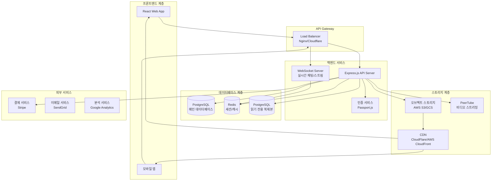

# PIYAKast 시스템 아키텍처 및 설치 가이드

## 🏗️ 시스템 아키텍처 개요



---

## 🖥️ 기술 스택

### 프론트엔드
- **Framework**: React 18 with TypeScript
- **State Management**: TanStack Query (React Query)
- **UI Library**: Tailwind CSS + shadcn/ui
- **Build Tool**: Vite
- **Routing**: Wouter

### 백엔드
- **Runtime**: Node.js 18+ LTS
- **Framework**: Express.js
- **Database ORM**: Drizzle ORM
- **Authentication**: Passport.js (로컬, OAuth)
- **WebSocket**: Native WebSocket API

### 데이터베이스
- **Primary**: PostgreSQL 15+
- **Cache**: Redis 7+
- **Session Store**: PostgreSQL (connect-pg-simple)

### 인프라스트럭처
- **Container**: Docker
- **Orchestration**: Docker Compose / Kubernetes
- **Reverse Proxy**: Nginx
- **Monitoring**: Prometheus + Grafana

---

## 🔧 환경별 설치 가이드

## 1️⃣ On-Premises 설치

### 시스템 요구사항

| 구성요소 | 최소 사양 | 권장 사양 |
|---------|----------|----------|
| CPU | 4 vCPU | 8 vCPU |
| RAM | 8GB | 16GB |
| Storage | 100GB SSD | 500GB NVMe SSD |
| Network | 100Mbps | 1Gbps |
| OS | Ubuntu 20.04+ | Ubuntu 22.04 LTS |

### 단계별 설치

#### Step 1: 시스템 준비
```bash
# 시스템 업데이트
sudo apt update && sudo apt upgrade -y

# 필수 패키지 설치
sudo apt install -y curl wget git nginx postgresql postgresql-contrib redis-server

# Node.js 18 설치
curl -fsSL https://deb.nodesource.com/setup_18.x | sudo -E bash -
sudo apt install -y nodejs

# Docker 설치
curl -fsSL https://get.docker.com -o get-docker.sh
sudo sh get-docker.sh
sudo usermod -aG docker $USER

# Docker Compose 설치
sudo curl -L "https://github.com/docker/compose/releases/latest/download/docker-compose-$(uname -s)-$(uname -m)" -o /usr/local/bin/docker-compose
sudo chmod +x /usr/local/bin/docker-compose
```

#### Step 2: 데이터베이스 설정
```bash
# PostgreSQL 사용자 생성
sudo -u postgres createuser --interactive piyakast
sudo -u postgres createdb piyakast -O piyakast

# 데이터베이스 설정
sudo -u postgres psql
ALTER USER piyakast PASSWORD 'secure_password';
GRANT ALL PRIVILEGES ON DATABASE piyakast TO piyakast;
\q

# Redis 설정
sudo systemctl enable redis-server
sudo systemctl start redis-server
```

#### Step 3: 애플리케이션 배포
```bash
# 소스 코드 클론
git clone https://github.com/your-org/piyakast.git
cd piyakast

# 환경 변수 설정
cp .env.example .env.production
# .env.production 파일 편집

# 의존성 설치 및 빌드
npm ci
npm run build

# 데이터베이스 마이그레이션
npm run db:push

# PM2로 프로덕션 실행
npm install -g pm2
pm2 start ecosystem.config.js --env production
pm2 save
pm2 startup
```

#### Step 4: Nginx 설정
```nginx
# /etc/nginx/sites-available/piyakast
server {
    listen 80;
    server_name yourdomain.com;
    return 301 https://$server_name$request_uri;
}

server {
    listen 443 ssl http2;
    server_name yourdomain.com;
    
    ssl_certificate /path/to/certificate.crt;
    ssl_certificate_key /path/to/private.key;
    
    # React 앱 정적 파일 서빙
    location / {
        root /var/www/piyakast/dist;
        try_files $uri $uri/ /index.html;
    }
    
    # API 프록시
    location /api {
        proxy_pass http://localhost:3000;
        proxy_http_version 1.1;
        proxy_set_header Upgrade $http_upgrade;
        proxy_set_header Connection 'upgrade';
        proxy_set_header Host $host;
        proxy_cache_bypass $http_upgrade;
        proxy_set_header X-Real-IP $remote_addr;
        proxy_set_header X-Forwarded-For $proxy_add_x_forwarded_for;
        proxy_set_header X-Forwarded-Proto $scheme;
    }
    
    # WebSocket 프록시
    location /ws {
        proxy_pass http://localhost:3000;
        proxy_http_version 1.1;
        proxy_set_header Upgrade $http_upgrade;
        proxy_set_header Connection "upgrade";
        proxy_read_timeout 86400;
    }
}
```

---

## 2️⃣ Heroku 배포

### Heroku 설정

#### Step 1: Heroku CLI 설치 및 로그인
```bash
# Heroku CLI 설치 (Ubuntu)
curl https://cli-assets.heroku.com/install-ubuntu.sh | sh

# 로그인
heroku login
```

#### Step 2: 애플리케이션 생성
```bash
# Heroku 앱 생성
heroku create your-app-name

# 애드온 추가
heroku addons:create heroku-postgresql:mini
heroku addons:create heroku-redis:mini

# 환경 변수 설정
heroku config:set NODE_ENV=production
heroku config:set SESSION_SECRET=$(openssl rand -hex 32)
heroku config:set GOOGLE_CLIENT_ID=your_google_client_id
heroku config:set GOOGLE_CLIENT_SECRET=your_google_client_secret
```

#### Step 3: Procfile 생성
```procfile
# Procfile
web: npm start
worker: npm run worker
```

#### Step 4: 배포
```bash
# Git 저장소 연결
git remote add heroku https://git.heroku.com/your-app-name.git

# 배포
git push heroku main

# 데이터베이스 마이그레이션
heroku run npm run db:push
```

---

## 3️⃣ AWS 배포

### AWS 인프라스트럭처 구성

#### Step 1: VPC 및 네트워크 설정
```yaml
# CloudFormation Template (infrastructure.yml)
AWSTemplateFormatVersion: '2010-09-09'
Description: PIYAKast Infrastructure

Resources:
  # VPC 구성
  VPC:
    Type: AWS::EC2::VPC
    Properties:
      CidrBlock: 10.0.0.0/16
      EnableDnsHostnames: true
      EnableDnsSupport: true
      Tags:
        - Key: Name
          Value: PIYAKast-VPC

  # 퍼블릭 서브넷
  PublicSubnet1:
    Type: AWS::EC2::Subnet
    Properties:
      VpcId: !Ref VPC
      AvailabilityZone: !Select [0, !GetAZs '']
      CidrBlock: 10.0.1.0/24
      MapPublicIpOnLaunch: true

  PublicSubnet2:
    Type: AWS::EC2::Subnet
    Properties:
      VpcId: !Ref VPC
      AvailabilityZone: !Select [1, !GetAZs '']
      CidrBlock: 10.0.2.0/24
      MapPublicIpOnLaunch: true

  # 프라이빗 서브넷
  PrivateSubnet1:
    Type: AWS::EC2::Subnet
    Properties:
      VpcId: !Ref VPC
      AvailabilityZone: !Select [0, !GetAZs '']
      CidrBlock: 10.0.3.0/24

  PrivateSubnet2:
    Type: AWS::EC2::Subnet
    Properties:
      VpcId: !Ref VPC
      AvailabilityZone: !Select [1, !GetAZs '']
      CidrBlock: 10.0.4.0/24
```

#### Step 2: RDS 데이터베이스 설정
```yaml
  # RDS PostgreSQL
  DatabaseCluster:
    Type: AWS::RDS::DBCluster
    Properties:
      Engine: aurora-postgresql
      EngineVersion: '15.3'
      DatabaseName: piyakast
      MasterUsername: piyakast
      MasterUserPassword: !Ref DatabasePassword
      VpcSecurityGroupIds:
        - !Ref DatabaseSecurityGroup
      DBSubnetGroupName: !Ref DatabaseSubnetGroup
      BackupRetentionPeriod: 7
      StorageEncrypted: true

  DatabaseInstance1:
    Type: AWS::RDS::DBInstance
    Properties:
      DBInstanceClass: db.r6g.large
      DBClusterIdentifier: !Ref DatabaseCluster
      Engine: aurora-postgresql
      PubliclyAccessible: false
```

#### Step 3: ECS 클러스터 설정
```yaml
  # ECS 클러스터
  ECSCluster:
    Type: AWS::ECS::Cluster
    Properties:
      ClusterName: piyakast-cluster
      CapacityProviders:
        - FARGATE
        - FARGATE_SPOT
      DefaultCapacityProviderStrategy:
        - CapacityProvider: FARGATE
          Weight: 1
        - CapacityProvider: FARGATE_SPOT
          Weight: 4
```

#### Step 4: 애플리케이션 배포
```bash
# ECR 저장소 생성
aws ecr create-repository --repository-name piyakast

# Docker 이미지 빌드 및 푸시
docker build -t piyakast .
docker tag piyakast:latest 123456789012.dkr.ecr.us-east-1.amazonaws.com/piyakast:latest
docker push 123456789012.dkr.ecr.us-east-1.amazonaws.com/piyakast:latest

# ECS 서비스 배포
aws ecs create-service \
  --cluster piyakast-cluster \
  --service-name piyakast-service \
  --task-definition piyakast-task:1 \
  --desired-count 2 \
  --launch-type FARGATE \
  --network-configuration "awsvpcConfiguration={subnets=[subnet-xxx,subnet-yyy],securityGroups=[sg-xxx],assignPublicIp=ENABLED}"
```

---

## 4️⃣ Google Cloud Platform (GCP) 배포

### GCP 인프라스트럭처 구성

#### Step 1: 프로젝트 설정
```bash
# GCP CLI 설치 및 인증
curl https://sdk.cloud.google.com | bash
gcloud auth login
gcloud config set project your-project-id

# 필요한 API 활성화
gcloud services enable compute.googleapis.com
gcloud services enable container.googleapis.com
gcloud services enable sqladmin.googleapis.com
gcloud services enable storage.googleapis.com
```

#### Step 2: Cloud SQL 설정
```bash
# Cloud SQL PostgreSQL 인스턴스 생성
gcloud sql instances create piyakast-db \
  --database-version=POSTGRES_15 \
  --tier=db-f1-micro \
  --region=us-central1 \
  --storage-type=SSD \
  --storage-size=20GB \
  --backup \
  --backup-start-time=03:00

# 데이터베이스 생성
gcloud sql databases create piyakast --instance=piyakast-db

# 사용자 생성
gcloud sql users create piyakast --instance=piyakast-db --password=secure_password
```

#### Step 3: GKE 클러스터 설정
```bash
# GKE 클러스터 생성
gcloud container clusters create piyakast-cluster \
  --zone=us-central1-a \
  --num-nodes=3 \
  --enable-autoscaling \
  --min-nodes=1 \
  --max-nodes=10 \
  --machine-type=e2-standard-2

# kubectl 설정
gcloud container clusters get-credentials piyakast-cluster --zone=us-central1-a
```

#### Step 4: Kubernetes 배포
```yaml
# k8s/deployment.yml
apiVersion: apps/v1
kind: Deployment
metadata:
  name: piyakast-app
spec:
  replicas: 3
  selector:
    matchLabels:
      app: piyakast
  template:
    metadata:
      labels:
        app: piyakast
    spec:
      containers:
      - name: piyakast
        image: gcr.io/your-project-id/piyakast:latest
        ports:
        - containerPort: 3000
        env:
        - name: DATABASE_URL
          valueFrom:
            secretKeyRef:
              name: piyakast-secrets
              key: database-url
        - name: SESSION_SECRET
          valueFrom:
            secretKeyRef:
              name: piyakast-secrets
              key: session-secret
---
apiVersion: v1
kind: Service
metadata:
  name: piyakast-service
spec:
  selector:
    app: piyakast
  ports:
  - port: 80
    targetPort: 3000
  type: LoadBalancer
```

#### Step 5: 배포 실행
```bash
# 컨테이너 이미지 빌드 및 푸시
docker build -t gcr.io/your-project-id/piyakast:latest .
docker push gcr.io/your-project-id/piyakast:latest

# Kubernetes 리소스 배포
kubectl apply -f k8s/secrets.yml
kubectl apply -f k8s/deployment.yml
kubectl apply -f k8s/service.yml

# 외부 IP 확인
kubectl get service piyakast-service
```

---

## 🔐 보안 설정

### SSL/TLS 인증서 설정

#### Let's Encrypt (무료)
```bash
# Certbot 설치
sudo apt install certbot python3-certbot-nginx

# 인증서 발급
sudo certbot --nginx -d yourdomain.com

# 자동 갱신 설정
sudo crontab -e
# 추가: 0 12 * * * /usr/bin/certbot renew --quiet
```

#### AWS Certificate Manager
```bash
# 인증서 요청
aws acm request-certificate \
  --domain-name yourdomain.com \
  --subject-alternative-names *.yourdomain.com \
  --validation-method DNS
```

### 방화벽 설정
```bash
# Ubuntu UFW 설정
sudo ufw enable
sudo ufw allow 22/tcp    # SSH
sudo ufw allow 80/tcp    # HTTP
sudo ufw allow 443/tcp   # HTTPS
sudo ufw deny 3000/tcp   # Node.js (내부 전용)
sudo ufw deny 5432/tcp   # PostgreSQL (내부 전용)
```

---

## 📊 모니터링 설정

### Prometheus + Grafana 설정

#### Docker Compose로 모니터링 스택 설정
```yaml
# monitoring/docker-compose.yml
version: '3.8'

services:
  prometheus:
    image: prom/prometheus
    ports:
      - "9090:9090"
    volumes:
      - ./prometheus.yml:/etc/prometheus/prometheus.yml

  grafana:
    image: grafana/grafana
    ports:
      - "3001:3000"
    environment:
      - GF_SECURITY_ADMIN_PASSWORD=admin
    volumes:
      - grafana-storage:/var/lib/grafana

  node-exporter:
    image: prom/node-exporter
    ports:
      - "9100:9100"

volumes:
  grafana-storage:
```

### 로그 수집 설정

#### ELK Stack (Elasticsearch, Logstash, Kibana)
```yaml
# logging/docker-compose.yml
version: '3.8'

services:
  elasticsearch:
    image: docker.elastic.co/elasticsearch/elasticsearch:8.5.0
    environment:
      - discovery.type=single-node
      - xpack.security.enabled=false
    ports:
      - "9200:9200"

  logstash:
    image: docker.elastic.co/logstash/logstash:8.5.0
    volumes:
      - ./logstash.conf:/usr/share/logstash/pipeline/logstash.conf
    ports:
      - "5044:5044"

  kibana:
    image: docker.elastic.co/kibana/kibana:8.5.0
    ports:
      - "5601:5601"
    environment:
      - ELASTICSEARCH_HOSTS=http://elasticsearch:9200
```

---

## 🚀 배포 자동화

### GitHub Actions CI/CD

```yaml
# .github/workflows/deploy.yml
name: Deploy to Production

on:
  push:
    branches: [main]

jobs:
  test:
    runs-on: ubuntu-latest
    steps:
      - uses: actions/checkout@v3
      - uses: actions/setup-node@v3
        with:
          node-version: '18'
      - run: npm ci
      - run: npm test

  deploy:
    needs: test
    runs-on: ubuntu-latest
    steps:
      - uses: actions/checkout@v3
      - name: Deploy to server
        uses: appleboy/ssh-action@v0.1.5
        with:
          host: ${{ secrets.HOST }}
          username: ${{ secrets.USERNAME }}
          key: ${{ secrets.SSH_KEY }}
          script: |
            cd /var/www/piyakast
            git pull origin main
            npm ci
            npm run build
            pm2 restart all
```

---

## 🔧 성능 최적화

### CDN 설정

#### CloudFlare 설정
```javascript
// cloudflare-workers.js
addEventListener('fetch', event => {
  event.respondWith(handleRequest(event.request))
})

async function handleRequest(request) {
  const url = new URL(request.url)
  
  // 정적 파일 캐싱
  if (url.pathname.match(/\.(js|css|png|jpg|jpeg|gif|ico|svg)$/)) {
    const response = await fetch(request)
    const newResponse = new Response(response.body, response)
    newResponse.headers.set('Cache-Control', 'public, max-age=86400')
    return newResponse
  }
  
  return fetch(request)
}
```

### 캐싱 전략

#### Redis 캐시 레이어
```javascript
// 캐시 설정 예시
const redis = new Redis({
  host: process.env.REDIS_HOST,
  port: process.env.REDIS_PORT,
  retryDelayOnFailover: 100,
  maxRetriesPerRequest: 3
})

// 비디오 메타데이터 캐싱 (1시간)
const cacheKey = `video:${videoId}`
await redis.setex(cacheKey, 3600, JSON.stringify(videoData))

// 트렌딩 비디오 캐싱 (10분)
const trendingKey = 'trending:videos'
await redis.setex(trendingKey, 600, JSON.stringify(trendingVideos))
```

---

## 📋 배포 체크리스트

### 프로덕션 배포 전 확인사항

- [ ] 환경 변수 모두 설정 완료
- [ ] 데이터베이스 마이그레이션 실행
- [ ] SSL 인증서 설정 완료
- [ ] 백업 시스템 구성 완료
- [ ] 모니터링 대시보드 구성
- [ ] 로드 테스트 실행
- [ ] 보안 스캔 완료
- [ ] DNS 설정 완료
- [ ] CDN 설정 완료
- [ ] 알림 시스템 테스트

### 배포 후 확인사항

- [ ] 애플리케이션 정상 동작 확인
- [ ] API 엔드포인트 테스트
- [ ] WebSocket 연결 테스트
- [ ] 데이터베이스 연결 확인
- [ ] 파일 업로드 테스트
- [ ] 결제 시스템 테스트
- [ ] 이메일 발송 테스트
- [ ] 성능 지표 모니터링
- [ ] 에러 로그 확인
- [ ] 사용자 피드백 수집

---

## 🆘 문제 해결 가이드

### 일반적인 문제들

#### 1. 데이터베이스 연결 오류
```bash
# 연결 확인
pg_isready -h localhost -p 5432 -d piyakast

# 로그 확인
sudo tail -f /var/log/postgresql/postgresql-15-main.log
```

#### 2. Node.js 메모리 부족
```bash
# Node.js 메모리 제한 증가
node --max-old-space-size=4096 server.js

# PM2에서 메모리 제한 설정
pm2 start server.js --max-memory-restart 2G
```

#### 3. 파일 업로드 실패
```bash
# 디스크 공간 확인
df -h

# 권한 확인
ls -la /var/www/piyakast/uploads/
sudo chown -R www-data:www-data /var/www/piyakast/uploads/
```

---

이 시스템 아키텍처 가이드를 통해 PIYAKast를 다양한 플랫폼에 안정적으로 배포할 수 있습니다. 각 환경의 특성에 맞는 최적화된 설정을 제공했으며, 확장성과 보안을 고려한 구성으로 설계되어 있습니다.